# 🚀 Logicware — Company Profile

> **Mission:** Empower organizations through intelligent automation and secure digital transformation.

---

## 🧭 Overview

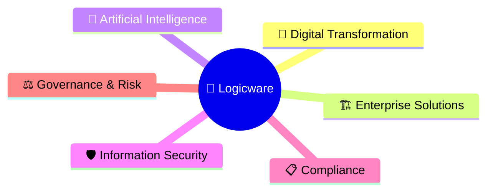

**Core Pillars**

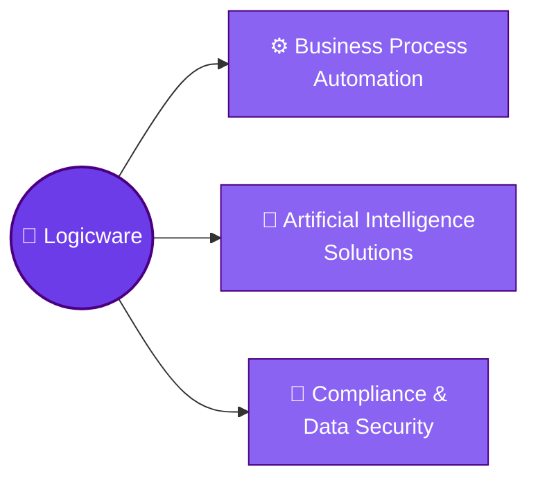

---

## 🧩 Service Portfolio

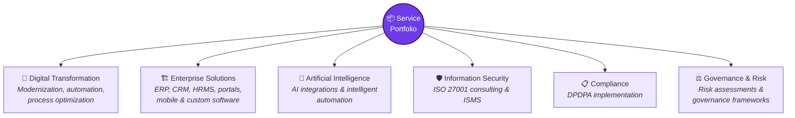

---

## 🏗️ Enterprise Solutions

### 💡 Expertise

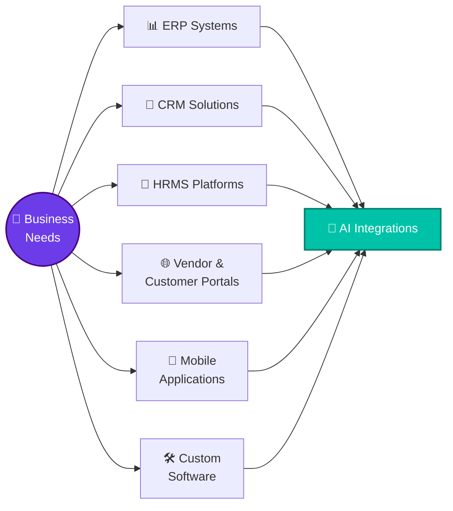

### ⚙️ Technology Stack

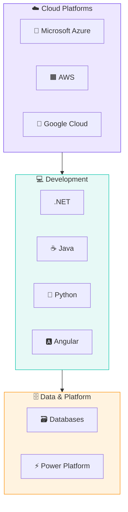

---

## 🛡️ Information Security & ISO 27001

### 🔁 ISO Lifecycle

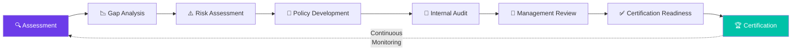

### 📦 Deliverables

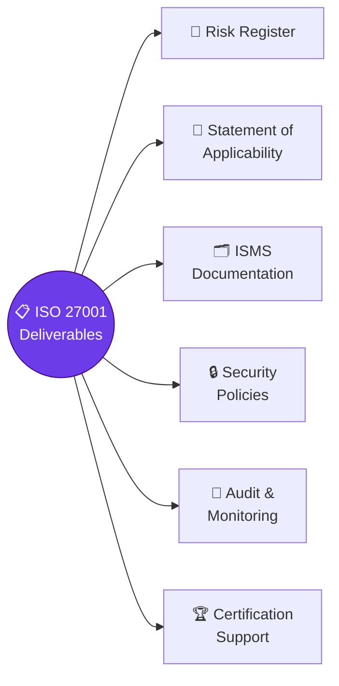

---

## 📋 DPDPA Compliance

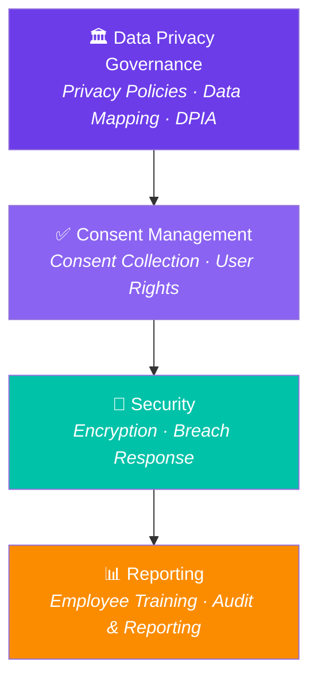

---

## 🌟 Why Logicware?

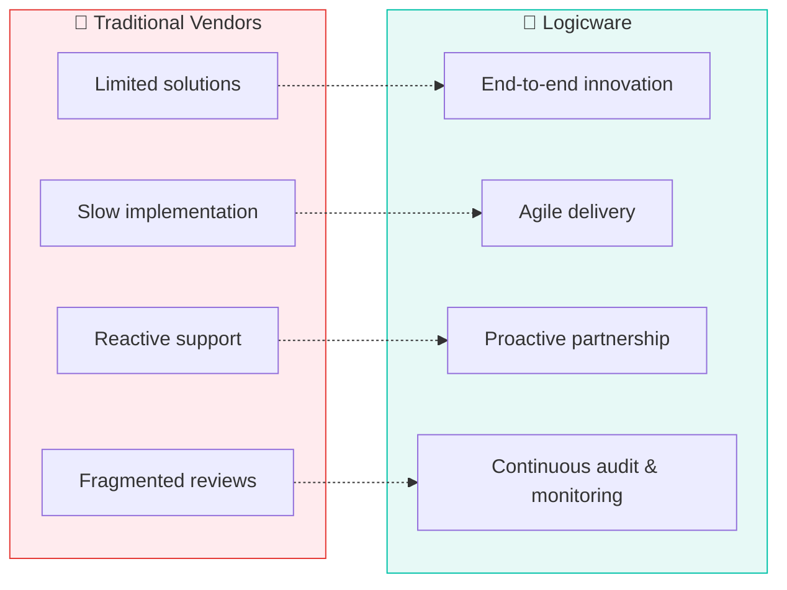

> 🛡️ **Security by Design** is the central philosophy.

---

## 🔄 Engagement Methodology

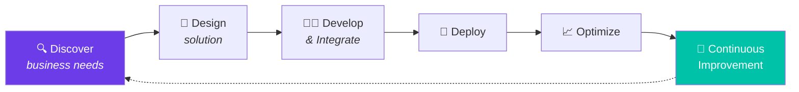

---

## 🎨 Visual Identity

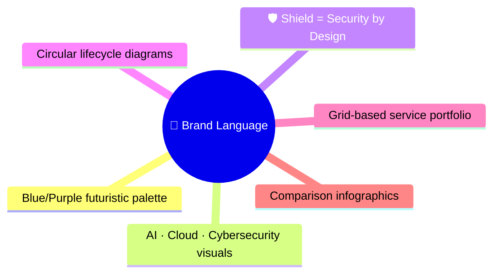

---

## ✅ Key Takeaways

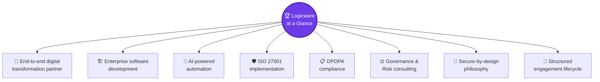
## Areas

### Data Privacy Governance

-   Privacy Policies
-   Data Mapping
-   DPIA

### Consent Management

-   Consent Collection
-   User Rights

### Security

-   Encryption
-   Breach Response

### Reporting

-   Employee Training
-   Audit & Reporting

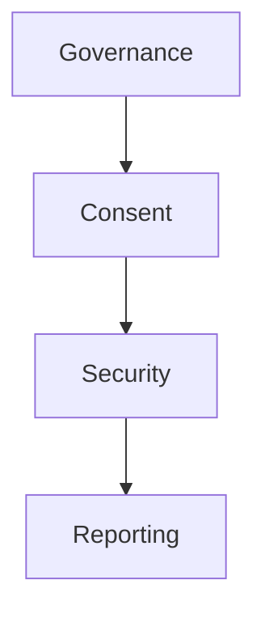

------------------------------------------------------------------------

# Why Logicware?

  Traditional Vendors   Logicware
  --------------------- -------------------------------
  Limited solutions     End-to-end innovation
  Slow implementation   Agile delivery
  Reactive support      Proactive partnership
  Fragmented reviews    Continuous audit & monitoring

Security by Design is the central philosophy.

------------------------------------------------------------------------

# Engagement Methodology

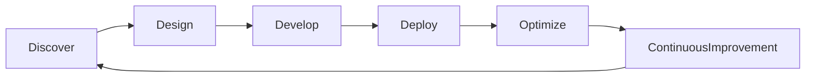

## Steps

1.  Discover business needs
2.  Design solution
3.  Develop & Integrate
4.  Deploy
5.  Optimize
6.  Continuous Improvement

------------------------------------------------------------------------

# Visual Summary

-   Blue/Purple futuristic branding.
-   AI, cloud, cybersecurity and enterprise visuals throughout.
-   Shield icon consistently represents Security by Design.
-   Circular lifecycle diagrams for ISO 27001 and client engagement.
-   Grid-based service portfolio.
-   Comparison infographic explaining competitive advantages.

------------------------------------------------------------------------

# Key Takeaways

-   End-to-end digital transformation partner.
-   Enterprise software development.
-   AI-powered automation.
-   ISO 27001 implementation.
-   DPDPA compliance.
-   Governance & Risk consulting.
-   Secure-by-design philosophy.
-   Structured engagement lifecycle.
